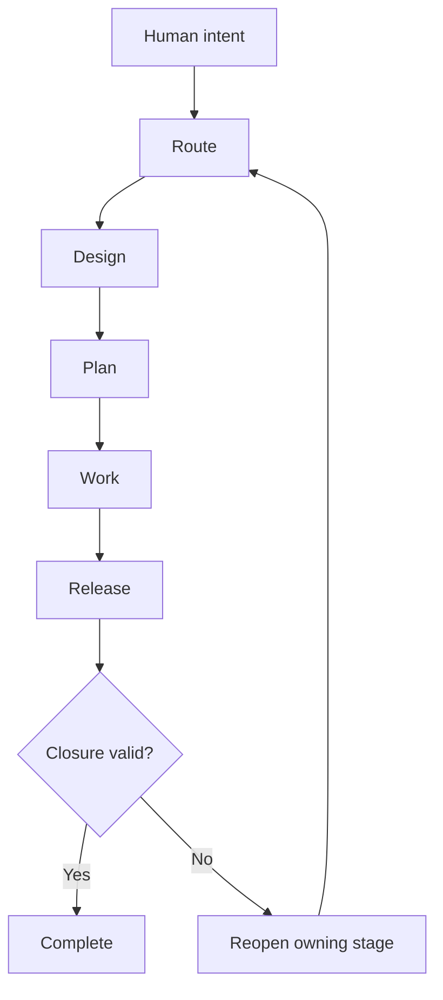
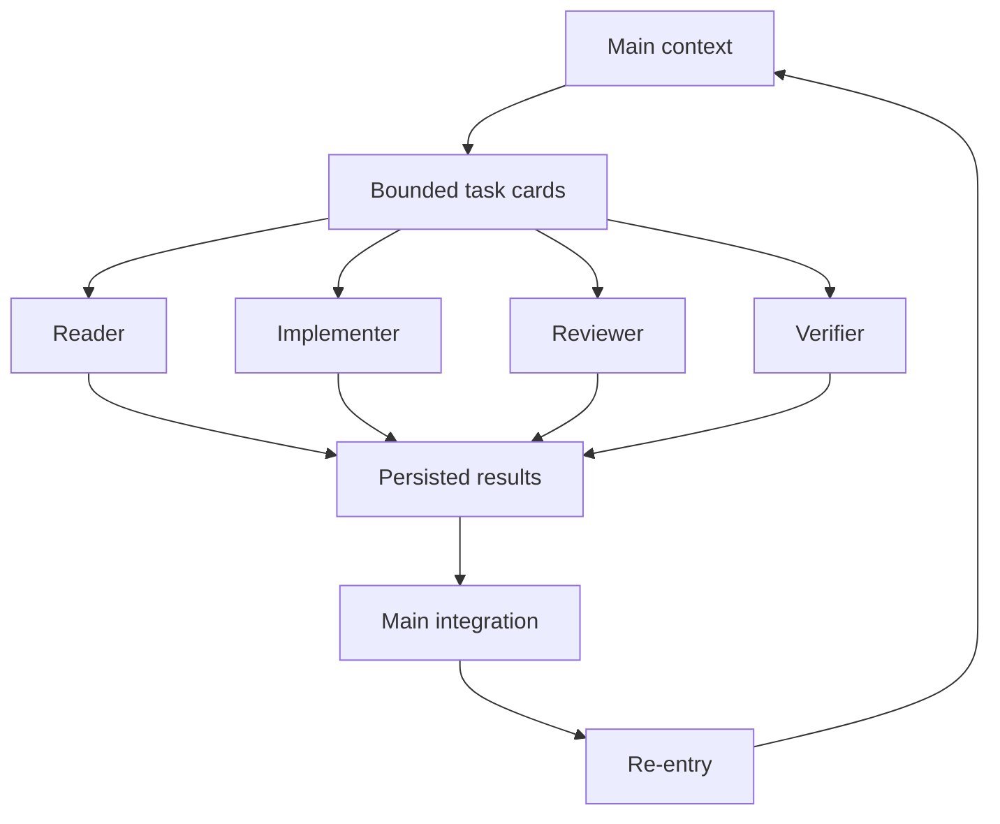

# DevSkill Unslop

> AI can write code faster than you can regret the architecture.
>
> — ChatGPT 5.6

DevSkill Unslop supports 10+ hour runs **without human** for implement phase in [Rebon agents](https://reboncode.ai/). It keeps the main context clean, uses bounded subagents, restores state from project files, and selects the right skill from the task. Humans still control design and permissions.

## Routing Chooses the Skill

Users describe the work. Route identifies the task type, selects the development stage, and loads only the modules that match.

| Task signal | Automatic route | Direct value |
|---|---|---|
| Unclear intent | Design grilling | Meaning comes before code |
| Architecture question | Architecture design | Boundaries come before files |
| Resolved design | Planning | Decisions become executable |
| Admitted work | Implementation and TDD | Changes stay bounded |
| Broken behavior | Diagnosis | Evidence comes before fixes |
| Review request | Matching review | Risk selects the checks |
| Release candidate | Release | Proof comes before closure |
| Writing request | Writing modules | Output stays readable |
| Context change | Re-entry | Active rules return |

The user does not need to remember which skill to name.

## Stage Families Hold Direction



Each stage owns one kind of decision. Problems return to the stage that can resolve them.

| Stage | Owns | Direct value |
|---|---|---|
| Route | Task classification | Correct work starts |
| Design | Meaning and boundaries | Human intent survives |
| Plan | Executable structure | Work stays focused |
| Work | Implementation and proof | Code matches decisions |
| Release | Evidence and permission | Closure stays honest |

## Modules Carry One Job

Every module defines when it applies, what it may do, and where its result goes.

| Module rule | Direct value |
|---|---|
| Clear trigger | Activates automatically |
| Required inputs | Prevents guessing |
| Bounded authority | Prevents self-promotion |
| Ordered operation | Prevents skipped steps |
| Named output | Makes results checkable |
| Named consumer | Keeps work moving |
| Failure route | Keeps problems recoverable |
| Invalidation rule | Blocks stale results |

This makes automatic skill selection reliable instead of prompt-dependent.

## Subagents Keep Context Clean



Repository reading, implementation, review, and verification can run in separate bounded contexts. The main agent receives compact results instead of carrying every file, attempt, and review trace.

That is how long runs stay coherent.

## Small Models Stay Useful

DevSkill supports powerful parallel agents, small online contexts, and a single local AI.

| Available setup | Execution strategy | Direct value |
|---|---|---|
| Single local AI | Sequential roles | No subagents required |
| Small online context | Bounded cards | Less context waste |
| Parallel online agent | Specialized subagents | Faster independent work |
| Long-running task | Durable handoffs | Progress survives resets |

**Small-context optimization** separates repository reading from planning and review. Evidence is gathered in bounded pieces, summarized once, and reused by later roles.

Failed oversized tasks split into smaller units. Valid outputs persist. Recovery uses smaller schemas instead of repeating the same failed request.

Large plans stop depending on one large context window.

## Files Keep the Agent Oriented

The project files hold the durable state. Chat history does not need to carry everything.

| Durable state | What it preserves |
|---|---|
| Current scope | Allowed work |
| Accepted decisions | Settled design |
| Current task | Active objective |
| Dependencies | Required ordering |
| Open gates | Needed decisions |
| Verification | Proof of completion |
| Next action | Resume position |

After compaction, restart, handoff, or subagent return, re-entry reloads the required files and validates the current state.

The agent knows what happened, what remains, and what must happen next.

## Long Runs Need Less Babysitting

Once goals and permissions are set, the agent can continue through planning, implementation, review, fixes, verification, and recovery without asking the user to govern every step.

| Situation | Agent behavior |
|---|---|
| Mechanical failure | Fix and continue |
| Review finding | Apply and recheck |
| Context loss | Reload and resume |
| Stale result | Invalidate and rerun |
| New design decision | Return to human |
| New permission | Return to human |

The agent keeps working. Human design and permission remain authoritative.

## Installation

Using a Skills-compatible installer:

```bash
npx skills@latest add shaggyfeng/Dev-Skill-Unslop
```

Or install the repository as `dev-skill` inside your agent’s personal skill directory.

For Codex:

```text
~/.codex/skills/dev-skill
```

Then describe the work:

```text
Use dev-skill for this task.
```

Route chooses what happens next.

## Lineage

DevSkill Unslop builds on Matt Pocock’s [Skills for Real Engineers](https://github.com/mattpocock/skills).

The original project brings real development methods into AI workflows. This overhaul connects those methods through routing, stage families, module contracts, durable state, and long-run execution.

## Author

**Shaggy Feng (嘴上云 | Mouth on Cloud)**

## License

Released under the [MIT License](./LICENSE).
