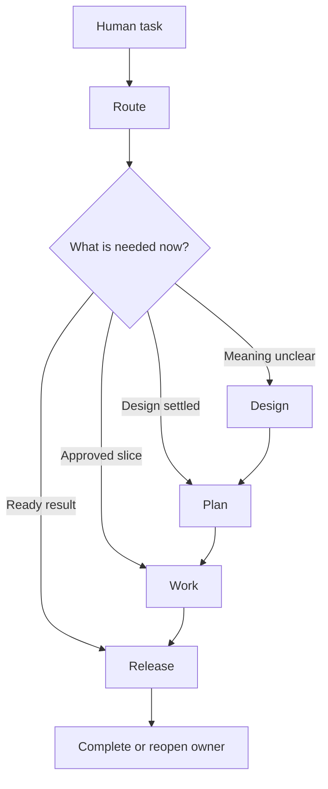
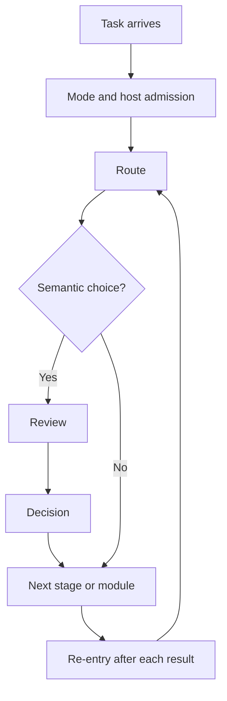

# DevSkill Unslop 2.0

> AI can write code faster than you can regret the architecture.
>
> — ChatGPT 5.6

DevSkill Unslop turns an AI agent from a prompt-driven helper into a developer with a working method: real-world professional workflows, a route that triggers the right capability, and a rule against work that looks safe but does not move the human goal.

## What it changes

- **Professional workflows** — design through release
- **Automatic routing** — no remembered prompts
- **Less defensive slop** — work must move value

## Lineage

DevSkill Unslop builds on Matt Pocock’s [Skills for Real Engineers](https://github.com/mattpocock/skills).

Matt’s project brought real engineering methods into agent work. This release rebuilds their runtime topology around stage families with more developed modules, explicit module contracts, automatic routing, durable re-entry, and a stricter answer to AI slop.

## A complete development route



| Family or overlay | Module or sub-operation | Job |
|---|---|---|
| Admission | Mode Gate | Confirm host, mode, and capability fit |
| Route | Route | Select one current consumer |
| Route | Project Discovery | Establish greenfield, brownfield, or uncertain facts |
| Route | Common Sense — Vibe and Attention | Retrieve a relevant pattern reference |
| Design | Grilling | Present reviewed design choices |
| Design | Review | Return bounded findings only |
| Design | Decision — Think and Humour | Represent, test, and select semantic options |
| Design | Research — Pathfinding | Find deep factual routes under fog |
| Design | Domain Modeling | Resolve terms, rules, and exact semantic writes |
| Design | Prototype | Answer one bounded runnable question |
| Design | Manual Procedure | Guide a temporary human operation |
| Design | Teaching | Build demonstrated human understanding |
| Design | Codebase Design | Choose seams, modules, and dependencies |
| Design | Improve Codebase Architecture | Surface evidence-backed architecture candidates |
| Plan | Two-Layer Development Planning | Show workflow and structure together |
| Plan | To-Spec | Shape accepted meaning into a specification |
| Plan | To-Tickets | Form outcome-bearing vertical slices |
| Work | Implementation and TDD | Change one accepted behavior at a time |
| Work | Diagnosing Bugs | Narrow symptoms to a supported cause |
| Work | Handoff and Boundaries | Transfer work across a real boundary |
| Work | Context Optimization | Bound reading, reasoning, writing, and continuation |
| Work | Rebon Host Adapter | Use Rebon-native workflow and task tools |
| Presentation | Write | Render reports, records, conversations, and instructions |
| Presentation | Markdown Tables and Diagrams | Render a selected structure clearly |
| Presentation | Writing Style | Select an explicit writing treatment |
| Presentation | Talk Like King | Style conversation and creative work without changing meaning |
| Release | Release | Reconcile work and return an effect or reopening path |

Each module has a task trigger, inputs, operation, authority boundary, return, and recovery path. The user may name a module, but naming it is never the only way it starts.

## The decision tree runs itself



This makes the skill usable without ritual prompts such as “now review,” “now research,” or “use TDD.” The agent can recognize the situation, load the right runtime instruction, and return its result to the right consumer.

## It refuses defensive busywork

AI often treats “more checking” as “more responsible.”

That can turn a five-minute task into a five-day ceremony: hashes, records, fallback layers, verification loops, and reports nobody will use.

DevSkill Unslop keeps a rule at the center:

> Retain a rule only when it changes a current read, question, choice, action, return, or human Value Gap.

A module may not add machinery merely because it looks safe. Review finds problems. Decision selects meaningful options. Work closes the actual gap.

## Built for short contexts and long runs

| Environment | Runtime approach |
|---|---|
| Local single agent | Sequential workflow |
| Small context window | Bounded reading and synthesis |
| Parallel agent host | Specialized bounded workers |
| Rebon optimized mode | Context optimization and durable continuation |

On compatible Rebon agents, a goal with settled design and permissions can continue for **10+ hours without constant human supervision**. Context-heavy reading, implementation, review, and verification stay bounded, so the main agent does not carry every file and failed attempt forever.

Humans still own meaning, authority, and permissions.

## Installation

```bash
npx skills@latest add shaggyfeng/Dev-Skill-Unslop
```

Or install the repository as `dev-skill` inside your agent’s skill directory.

For Codex:

```text
~/.codex/skills/dev-skill
```

Then describe the task normally. The skill routes the work.

## Author

**Shaggy Feng (嘴上云 | Mouth on Cloud)**

## License

[MIT](./LICENSE)
