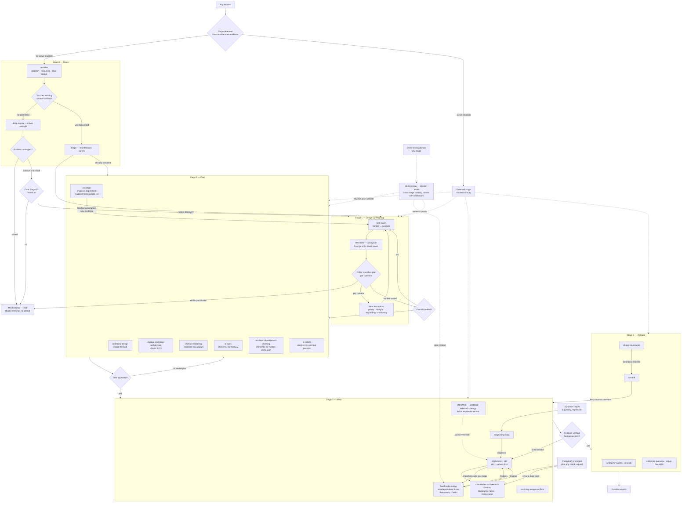

# Development workflow

Router and operating contract. Read order: mode classification (first operating action) → stage detection (second) → session persistence → Layer 1 (which skill fires at which stage) → Layer 2 (which skill is enabled for which content) → routing index → standing contract. The workflow is identical in every mode; only per-mode instructions differ. Once enabled, the skill stays enabled for the session. System, developer, and user instructions override this skill.

## Mode activation

Before any task work, classify the development host, provider, and workload into one operating mode. Modes are capability classes, never brands; named hosts are examples. The host/provider classification answers what the agent can do. The workload choice answers whether the extra UltraWork decomposition is worth its overhead.

| Internal identifier | Human-facing mode | Short | Capability and default use | UltraWork |
|---|---|---|---|---|
| `parallel-isolated` | parallel-cheap | `cheap` | Delegated subagents with high throughput; use for cheap providers with usable subagents or long, unattended frontier runs. | Selected for the workload; full four-stage preflight and Kanban. |
| `parallel-bounded` | parallel-normal | `normal` | Ordinary frontier or online work with the host's native workflow; this is the default for normal interactive work. | Not required; opt in for a long or otherwise oversized run. |
| `sequential-local` | sequential-single | `single` | One local model with no usable subagents; run the same DevSkill roles one at a time with bounded handoff packets. | Use the sequential form when the workload needs decomposition; never assume native subagent dispatch exists. |

Classify from trusted host/provider metadata or an explicit human statement; if neither confirms, ask the human before task work — never guess. Re-classify only when the host, provider, or workload choice actually changes.

UltraWork is DevSkill's optional workload strategy: atomic breakdown (roadmap → phase → slice → agent-sized task), four-stage preflight (Reader/Task Breaker → Planner → Deep Reviewer → Plan Applier), card contracts, bounded writes, and recovery. It is valuable when provider cost, context limits, unattended duration, or task size justify the ceremony; it is not mandatory for normal frontier work. Rebon Workflow is an optional visual dispatch vehicle when the host supports it and the user selects it; it adds no authority. The full strategy is in [ultrawork-orchestration.md](references/ultrawork-orchestration.md).

Role separation is workflow-invariant: a local single-model host runs the same roles sequentially through bounded handoff packets, while a host with usable subagents may delegate them. A local model never depends on a native subagent workflow that it cannot access.

References MUST NOT restate provider or workload forks; point to this table. Historical per-setup duplicates (subagent vs single-model files) were merged under this rule.

### Activation decision

1. Determine `host_kind`, `provider_kind`, subagent availability, and any explicit workload request from trusted metadata; if a field is unknown, ask one focused question before task work.
2. A local provider with no usable subagents enters `sequential-single`; the main model performs Reader, Planner, Reviewer, Applier, implementation, and verification roles one at a time with handoff packets.
3. A normal online or frontier provider enters `parallel-normal` by default and uses its native workflow. Do not impose UltraWork merely because subagents exist.
4. Select `parallel-cheap` and UltraWork when the provider is cheap with usable subagents, the run is long or unattended, or the task is large enough that bounded decomposition materially reduces failure risk.
5. When the host is Rebon and the user selects the optional Workflow display for a workload already using UltraWork, read [rebon-workflow-visual-display.md](references/rebon-workflow-visual-display.md). Normal Rebon work may remain native and does not require the display.
6. State the selected human-facing mode and workload strategy, preserve them for the session, and reclassify only when the host, provider, or explicit workload choice changes.

## Stage detection

Immediately after mode activation, determine the current situation's stage from durable workspace state, so the user goes straight to work and the stage's skills fire automatically.

| Evidence found                                                                     | Situation                | Enter                  |
| ---------------------------------------------------------------------------------- | ------------------------ | ---------------------- |
| open review findings; verified diff without accepted close-out                     | Work close-out in flight | Stage 3 fix loop       |
| open tickets; in-flight diff; handoff doc; active board or slice records           | Work in progress         | Stage 3                |
| approved spec without tickets                                                      | atomization pending      | Stage 2 (`to-tickets`) |
| candidate spec; paired views; ADR drafts; questionnaire returns awaited            | Plan in progress         | Stage 2                |
| open grill frontier; decision map with open tickets; unresolved frontier questions | Design in progress       | Stage 1                |
| accepted change without records or handoff                                         | Release pending          | Stage 4                |

- Most downstream unfinished obligation wins: open review finding > open tickets > approved un-ticketed spec > open grill question.
- Multiple unrelated active situations: list them with evidence, ask which to resume — one bounded question, never a guess.
- Announce the detection in one line; a user correction is authoritative.
- No active-situation evidence, or a new problem nothing covers: enter ask-dev intake (Stage 0).
- Read only durable artifacts — specs, tickets, ADRs, maps, boards, reports, handoff docs, review records — never chat history or hidden state, so fresh sessions resume identically.

## Session persistence

Enablement is session-level state.

- The skill stays the operating contract for all work until the user explicitly disables it; never silently dropped between tasks.
- Every task runs through its corresponding stage subskill: an edit is a Work slice; a decision-opening question is a grill round; an artifact challenge is session-mode review; a fact lookup is research. No work outside the structure.
- Uncovered requests route through ask-dev intake — there is no raw path around the stages.
- Mode and detected stage persist across tasks; transitions follow Layer 1 on evidence, never drop-and-re-enter.
- Structure constant, depth scaled to the task: a one-line fix is a Work slice sized to one line.

## Layer 1 — Workflow evolution: which skill fires at which stage

Non-renderer summary: activation detects the stage from durable artifacts and enters it; otherwise Route dispatches on the artifact-touch binary (greenfield → intake untangle → exit or Stage 1 offer; brownfield → triage → Design or Plan). Design loops grill rounds with the always-on reviewer; Plan shapes and specifies then atomizes; Work runs implement → three-axis review → fix per slice with UltraWork slicing; Release records and carries. Session-mode review overlays Design and Plan; three direct entries (pasted diff, symptom, review phrase) bypass detection and Route.

## Layer 2 — Trigger and enablement: which skill is enabled for which content

Trigger types: stage-automatic · content-present · user-explicit · never-inferred. No skill is user-explicit-only; the sole activation exception is session-mode deep review, satisfied by the deterministic offer.

| Content / condition                                                                   | Skill                              | Trigger type                                                                                                        | Authority gained / NOT gained                            |
| ------------------------------------------------------------------------------------- | ---------------------------------- | ------------------------------------------------------------------------------------------------------------------- | -------------------------------------------------------- |
| new problem, no active situation                                                      | ask-dev                            | stage-automatic after stage detection                                                                               | dispatches only; never treats the work                   |
| greenfield (no existing artifact touched)                                             | deep review · intake mode          | dispatched by ask-dev                                                                                               | untangles; never records; never persists                 |
| brownfield (existing artifact touched)                                                | triage · maintenance survey        | dispatched by ask-dev                                                                                               | maps what to maintain; routes to Stage 1 or 2            |
| uncertain plan or decision; a re-opened gap                                           | grilling (merged)                  | user-invoked or dispatched                                                                                          | facilitates; never answers for the human                 |
| every grill round                                                                     | deep review · grill infrastructure | always on during grilling                                                                                           | findings feed the griller's classification; never steers |
| greenfield structure work                                                             | codebase-design                    | stage-conditional                                                                                                   | proposals only                                           |
| brownfield structure work                                                             | improve-codebase-architecture      | stage-conditional                                                                                                   | proposals only                                           |
| evidence needed from outside the text world                                           | prototype                          | stage-conditional                                                                                                   | disposable; no accepted artifact                         |
| vocabulary or ADRs needed                                                             | domain-modeling                    | stage-conditional                                                                                                   | append-only entries                                      |
| plan ready for machine consumption                                                    | to-spec                            | stage-automatic after Plan                                                                                          | candidate spec; publication human-only                   |
| plan needs human-verifiable structure                                                 | two-layer-development-planning     | stage-conditional                                                                                                   | paired views; verification is human                      |
| approved spec exists                                                                  | to-tickets                         | stage-automatic                                                                                                     | atomic tickets                                           |
| admitted work with a cheap/long workload                                              | UltraWork strategy                 | workload-selected                                                                                                   | slices and gates only; never publishes                   |
| every completed slice                                                                 | code-review (three-axis)           | stage-automatic close-out + "review since X"                                                                        | findings only; never approves; axes never reranked       |
| important code pre-merge; session mode + code; pasted diff + any check; explicit hunt | hard-code-review                   | stage-automatic · overlay-linked · content-present · user-explicit                                                  | bounded findings; never fixes or approves                |
| symptom present                                                                       | diagnosing-bugs                    | content-present                                                                                                     | diagnosis before change                                  |
| active merge/rebase conflict                                                          | resolving-merge-conflicts          | content-present                                                                                                     | resolved merge                                           |
| accepted change                                                                       | writing-for-agents, records        | stage-automatic                                                                                                     | durable docs per project conventions                     |
| boundary or context carry                                                             | phase-boundaries, handoff          | stage-conditional                                                                                                   | boundary decision; portable doc                          |
| consequential decision or artifact                                                    | deep review · session mode         | never-inferred; explicit phrase or deterministic offer + affirmative reply; carries across stages with notification | findings only; never records; human-only resolution      |
| external facts missing and blocking                                                   | research                           | situational + user-invoked                                                                                          | cited findings file                                      |
| concept gap blocks the human's answer                                                 | teach                              | situational + user-invoked                                                                                          | learning record for the human                            |
| plan contains human-only steps                                                        | wizard                             | situational + user-invoked                                                                                          | guided completion                                        |
| human confusion signal                                                                | writing-for-agents · re-pitch      | situational (any confusion phrasing)                                                                                | re-pitched explanation; no artifact                      |
| doc work needs tables or diagrams                                                     | markdown-tables-and-diagrams       | situational                                                                                                         | rendering-safe views of authoritative text               |

## Routing index

Pointers only; trigger semantics live in Layer 2.

| Situation                                                                                        | Read                                                                                                                                                                            |
| ------------------------------------------------------------------------------------------------ | ------------------------------------------------------------------------------------------------------------------------------------------------------------------------------- |
| Any first request; don't know what you need                                                      | [ask-dev.md](references/ask-dev.md)                                                                                                                                             |
| Hard review: important code pre-merge, deep hunt, second opinion on code                         | [hard-code-review.md](references/hard-code-review.md)                                                                                                                           |
| Sharpen an uncertain plan, decision, or idea                                                     | [grilling.md](references/grilling.md)                                                                                                                                           |
| Structure to build / to fix / to probe experimentally                                            | [codebase-design.md](references/codebase-design.md) · [improve-codebase-architecture.md](references/improve-codebase-architecture.md) · [prototype.md](references/prototype.md) |
| Domain vocabulary, rules, ADRs                                                                   | [domain-modeling.md](references/domain-modeling.md)                                                                                                                             |
| Spec for implementation                                                                          | [to-spec.md](references/to-spec.md)                                                                                                                                             |
| Human-verifiable plan structure                                                                  | [two-layer-development-planning.md](references/two-layer-development-planning.md)                                                                                               |
| Atomize approved plan                                                                            | [to-tickets.md](references/to-tickets.md)                                                                                                                                       |
| Do the work                                                                                      | [implement.md](references/implement.md) + [tdd.md](references/tdd.md); [ultrawork-orchestration.md](references/ultrawork-orchestration.md) per mode                             |
| Review a completed change                                                                        | [code-review.md](references/code-review.md) (three-axis)                                                                                                                        |
| Deep-review a decision or artifact                                                               | [deep-decision-review.md](references/deep-decision-review.md)                                                                                                                   |
| Brownfield maintenance survey                                                                    | [triage.md](references/triage.md)                                                                                                                                               |
| Diagnose a symptom                                                                               | [diagnosing-bugs.md](references/diagnosing-bugs.md)                                                                                                                             |
| Resolve a merge/rebase                                                                           | [resolving-merge-conflicts.md](references/resolving-merge-conflicts.md)                                                                                                         |
| Boundary decision or fresh-session carry                                                         | [phase-boundaries.md](references/phase-boundaries.md) · [handoff.md](references/handoff.md)                                                                                     |
| Record accepted work; edit agent-facing docs                                                     | [writing-for-agents.md](references/writing-for-agents.md) · [markdown-tables-and-diagrams.md](references/markdown-tables-and-diagrams.md)                                       |
| Research external facts                                                                          | [research.md](references/research.md)                                                                                                                                           |
| Provenance of the collection                                                                     | [collection-overview.md](references/collection-overview.md)                                                                                                                     |
| Configure tracker conventions                                                                    | [setup-dev-skills.md](references/setup-dev-skills.md)                                                                                                                           |
| Teach; guide a manual procedure; edit agent-facing docs (incl. the re-pitch and concision craft) | [teach.md](references/teach.md) · [wizard.md](references/wizard.md) · [writing-for-agents.md](references/writing-for-agents.md)                                                 |
| Optional Rebon Workflow display for a selected UltraWork run                                      | [rebon-workflow-visual-display.md](references/rebon-workflow-visual-display.md)                                                                                                 |

## Standing contract

1. Modes classify the development host and workload; target-application execution rules are outside this skill.
2. A Standing Development Gate Authorization covers only its named gates; an uncovered gate pauses for the human.
3. Role separation is mode-invariant. A reviewer NEVER implements, fixes, approves, or publishes; findings return to the loop.
4. Review exists in three places only — intake (ask-dev-dispatched, non-persistent), grill infrastructure (always on during grilling), session mode (never-inferred: explicit phrase, or deterministic offer plus affirmative reply; carried across stages with notification). All three are findings-only: none records, edits documents, or publishes. Recording belongs to the active workflow — grilling's with-docs instruction, or the workflow's normal artifacts, after human resolution.
5. One standard work loop: implement → three-axis review → fix → verified. Review and testing are part of the workflow, never a later stage.
6. The three direct entries (pasted diff, symptom report, review phrase) skip detection and Route by design.
7. Once enabled, the skill stays enabled; every task runs through its stage subskill — structure constant, depth scaled to the task. Only an explicit user disable ends it.
