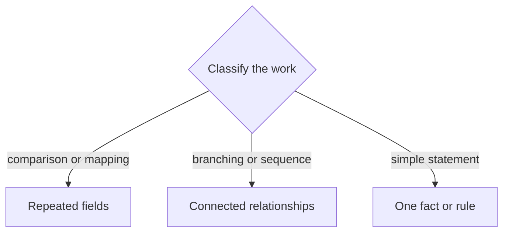

# Markdown tables and diagrams

Format project documentation so it renders predictably and remains easy to review in diffs. Treat tables and diagrams as explanatory views of authoritative text or governed records, never as independent sources of truth.

## Preserve prose line integrity

Write every ordinary paragraph, list item, blockquote paragraph, and heading on one physical Markdown line. Never hard-wrap a sentence or paragraph merely to limit source-line width.

Break a physical line only at a real Markdown structural boundary, such as:

- between paragraphs;
- between separate list items;
- between headings and their content;
- between code or diagram lines whose syntax requires separate lines;
- or between table rows.

Inside a table cell or Mermaid label, use `<br>` only when a deliberate visual break prevents an excessively wide or unreadable rendered element. Do not use `<br>` to wrap ordinary prose or ordinary list items.

When editing an existing document, preserve intentional author-written line breaks unless the user asks for reflow. Do not reintroduce hard wrapping into prose the user has already placed on single lines.

## Choose the smallest useful form

| Information shape | Preferred form | Use it for |
|---|---|---|
| One fact or short rule | Prose | A statement that needs no repeated fields or relationships |
| Repeated fields across items | Markdown table | Comparisons, mappings,<br>contracts, candidate sets |
| Three or more connected nodes | Mermaid diagram | Branching, dependencies,<br>lifecycles, decision paths |
| Exact normative behavior | Prose plus tests/schema | Authority that must remain unambiguous and machine-checkable |

Do not add a visualization merely because a section has several steps. Prefer prose when it is equally clear.

## Write Markdown tables

1. Put a blank line before and after every table.
2. Keep every table row adjacent. Never put a blank line between the header, separator, or body rows.
3. Write one physical Markdown line per table row.
4. Include one header row and one separator row.
5. Use `<br>` for deliberate line breaks inside dense cells. Do not insert a literal newline inside a row.
6. Escape a literal pipe as `\|`.
7. Keep cell contents parallel and concise. Move long explanations below the table.
8. Use alignment markers only when alignment conveys meaning.
9. Do not put multiline lists or fenced code blocks inside table cells.

Use this rendering-safe pattern:

```markdown
| # | Family | Core Value Gap | Key Concepts |
|---|--------|----------------|--------------|
| 1 | **Example Family** | First gap,<br>second gap | First concept,<br>second concept |
| 2 | **Another Family** | One concise gap | One concept,<br>another concept |
```

## Write Mermaid diagrams

Use Mermaid when topology or sequence is harder to understand from prose:

- Choose `flowchart TB`, `flowchart TD`, or `flowchart LR` according to the rendered diagram's shape and the reader's available window, not from the subject matter alone.
- Prefer `TB` or `TD` when an `LR` layout would become too wide, be clipped, require horizontal scrolling, or force the reader to pan.
- Prefer `LR` when the graph has a short sequence, limited branching, and can fit comfortably across the expected reading window.
- Use `sequenceDiagram` for interactions ordered over time.
- Use `stateDiagram-v2` for governed lifecycle states and transitions.

### Choose a viewport-safe flow direction

Estimate the rendered aspect ratio before choosing a direction. The best direction is the one that shows the complete relationship at a readable scale with the least clipping, scrolling, zooming, or movement.

| Diagram shape | Usually prefer | Reason |
|---|---|---|
| Many sequential stages but few nodes per stage | `LR` if the complete chain remains comfortably visible; otherwise `TB` or `TD` | A short horizontal pipeline reads naturally, but a long one becomes clipped |
| Wide branching tree or many sibling nodes | `TB` or `TD` | Siblings can spread across rows without creating an extremely long horizontal chain |
| Deep hierarchy with short labels | Compare `TB`/`TD` and `LR`; choose the more compact rendered result | Depth alone does not determine the best viewport fit |
| Dense graph with long labels | `TB` or `TD`, shorter labels, or multiple focused diagrams | Long labels make horizontal layouts excessively wide |
| Small decision flow with two or three branches | Either direction | Choose the direction that fits the target reading window without panning |

`TB` and `TD` both mean top-to-bottom flow in Mermaid. Use whichever is already conventional in the document; changing between them does not solve a layout problem by itself.

Do not preserve a direction merely because an earlier version used it. When editing a diagram, reassess the node count, label length, branching width, and likely reader viewport. If no single direction keeps the diagram readable, split it into two focused diagrams instead of producing an oversized canvas.

For flowcharts:

1. Give every node a short, stable ASCII identifier.
2. Put human-readable labels in quoted brackets when they contain punctuation.
3. Put one edge on each line so diffs remain readable.
4. Label edges only when the transition meaning is not obvious.
5. Keep the diagram focused. Split unrelated relationships into separate diagrams.
6. Add a short prose explanation for readers who do not render Mermaid.
7. State which text, schema, or governed record is authoritative when the diagram summarizes normative behavior.
8. Derive diagram labels and relationships from the authoritative source. Do not hand-maintain competing facts in the diagram.
9. Choose the flow direction after considering the rendered width and height, not through a fixed mapping from diagram type to direction.
10. Keep labels concise and use `<br>` only when a deliberate label break materially improves viewport fit.
11. Prefer a complete diagram visible in the reading window over a layout that requires repeated horizontal scrolling or panning.

Use this pattern:



## Validate the result

Before finishing:

- Inspect every table for an equal number of unescaped cell separators per row.
- Confirm no blank line occurs between any two rows of the same table.
- Confirm dense cells use `<br>` and remain on one physical line.
- Confirm ordinary paragraphs, list items, blockquotes, and headings have not been hard-wrapped across physical lines.
- Confirm every Mermaid fence closes.
- Confirm node identifiers are unique and every referenced node exists.
- Confirm the chosen direction keeps the complete diagram reasonably visible in the expected reading window.
- Confirm another direction or a split diagram would not materially reduce clipping, scrolling, zooming, or panning.
- Confirm the diagram agrees with its authoritative prose or governed record.
- Run the repository's Markdown or diff checks when available.
