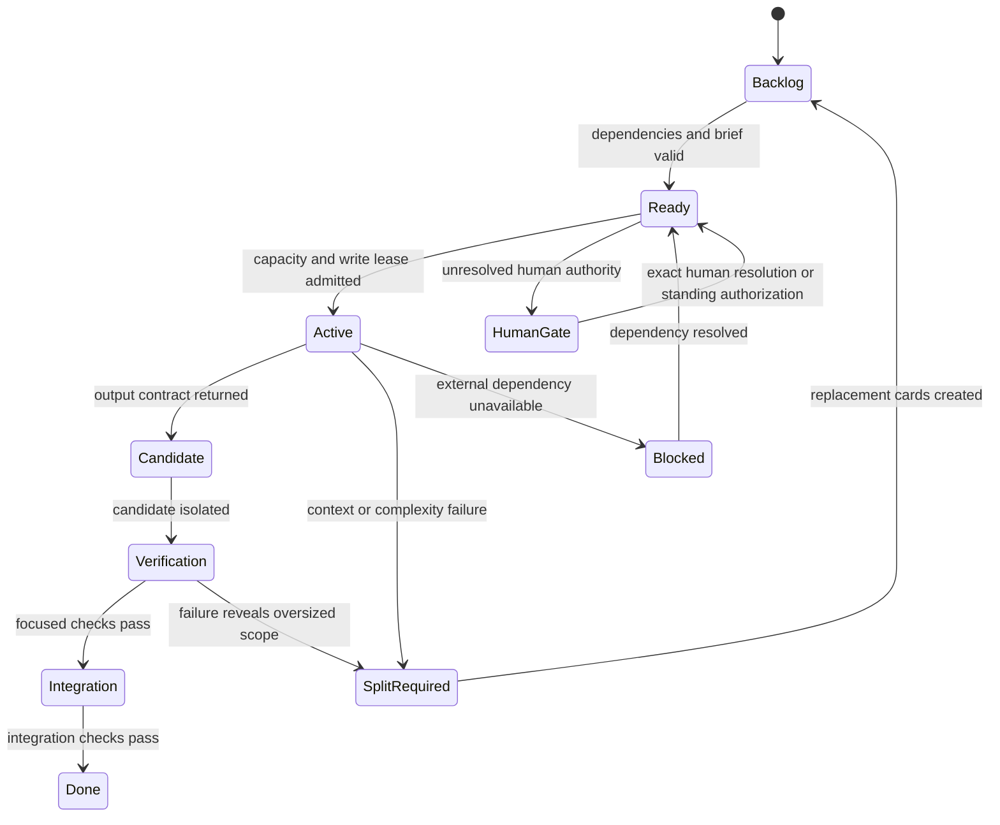

# UltraWork orchestration

UltraWork is the optional workload strategy selected by the mode table in [SKILL.md](../SKILL.md). Use it for cheap providers with usable subagents, long or unattended frontier runs, or tasks whose size makes bounded decomposition materially safer. Normal interactive frontier work may use the host's native workflow without UltraWork. A local single-model host runs the same four-stage roles sequentially through handoff packets when UltraWork-style decomposition is selected; it never assumes native subagent dispatch. On Rebon, Workflow is an optional visible dispatch vehicle when the user selects it for an UltraWork run. An existing plan is an input packet, never a bypass around the prework Kanban gate.

## Contents

- Provider, capacity, and workload discovery
- Orchestration modes
- One Kanban workflow per plan item
- Pre-Kanban four-agent planning preflight
- Large-context task and artifact fanout
- Per-slice preflight and Kanban build cycle
- Bounded coordinator fallback
- Card contract and state machine
- Dispatch and context rules
- Gate authorization
- Failure recovery
- Workflow-engine stage limits (verified 2026-08-14)
- Integration with other DevSkill workflows
- Completion evidence

## Keep DevSkill development scope separate

DevSkill governs development orchestration only. It does not define, mutate, or summarize the target project's runtime, controller, deployment, or application authority. Those rules belong to the target project's own governing documents and are not repeated here. Record a **Development Execution Profile** only after mode activation confirms the host, provider, and available dispatch capacity.

| Development field | Question answered | Example |
| --- | --- | --- |
| `host_kind` | Which host is coordinating development? | Rebon, Codex, or another agent host |
| `provider_kind` | Which provider class is available to the development host? | Local single-model or online frontier provider |
| `host_subagents_available` | Can the host dispatch fresh-context subagents? | `true` for a host exposing usable subagent calls |
| `max_simultaneous_model_calls` | What development concurrency has been verified? | A human-confirmed or host-reported limit |
| `workload_strategy` | Is native, full UltraWork, or sequential decomposition selected? | `native`, `ultrawork`, or `sequential` |

## Provider, capacity, and workload discovery

Confirm host/provider identity and the selected workload strategy before creating a Development Execution Profile or Kanban cards. Evidence order:

1. Confirm host and provider classification from trusted metadata or an explicit human statement.
2. Read the host's subagent availability and verified concurrency limit when the selected strategy may delegate.
3. Reuse a current human-confirmed Development Execution Profile only for the same host session and workload.
4. If host, provider, capacity, or workload strategy is unknown, ask the human before task-specific work; until confirmed, classify UltraWork `not_applicable` — never guess.

| Field | Meaning |
| --- | --- |
| `host_kind` | Host kind, e.g. `rebon`, `codex`, or other |
| `provider_kind` | Provider kind per the mode table |
| `provider_source` | Host metadata, trusted config, or human confirmation |
| `host_subagents_available` | Whether the host exposes fresh-context subagents |
| `max_simultaneous_model_calls` | Verified or human-confirmed provider capacity |
| `host_agent_limit` | Host-side active-agent limit when known |
| `human_parallelism_cap` | Optional human cap for this development run |
| `effective_parallelism` | Minimum of the applicable positive limits and the ready dependency frontier |
| `workload_strategy` | `native`, `ultrawork`, or `sequential` |

Refresh the profile when the provider, account, tool availability, concurrency, or workload choice changes; a resumable checkpoint records the profile fields and evidence source. If the selected workload no longer justifies UltraWork, stop creating new UltraWork cards and continue through the host's native workflow or the sequential handoff path.

## Admission strategies

| Strategy | Admission condition | Rule |
| --- | --- | --- |
| `isolated_full` | UltraWork selected with usable subagent dispatch | Run dependency-independent, write-disjoint cards up to `effective_parallelism` |
| `sequential_modified` | UltraWork selected on a local single-model host or a host without usable subagents | Run the same stages, gates, and bounded writes one role at a time; handoff packets carry state between roles |
| `not_applicable` | Native workload or unconfirmed strategy | Do not apply this reference; use the host's native workflow and ordinary repository instructions |

## Plan-driven Kanban gate (UltraWork-selected workload)

Within an UltraWork-selected run, the Kanban workflow is mandatory for every plan-driven task — including one with a detailed checklist or an apparently one-small-edit task. The coordinator first creates a bounded prework packet, runs the four-stage pre-Kanban preflight, validates the artifacts, then creates one execution board for the applicable roadmap or checklist item, only from that validated final atomic plan. A host with usable subagents delegates the roles; a local single-model host runs them sequentially through handoff packets. Native normal work has no Kanban obligation.

The generic preflight harness and item-specific execution script are different script classes. The execution-script gate blocks only the latter; the generic harness contains no item-specific cards or implementation work. Every delegated DevSkill role in an UltraWork run uses the selected dispatch contract: visible Workflow on Rebon only when the user selects that display, native subagent dispatch on another capable host, or a fresh sequential role context on a local host; never an unrelated standalone call.

Provider capacity changes dispatch width, not whether the four stages exist:

| Strategy | Reader/Task Breaker → Planner → Deep Reviewer → Plan Applier | Execution |
| --- | --- | --- |
| `isolated_full` | Fresh-context subagents perform the roles; Applier groups remain sequential | Independent, write-disjoint cards may run in parallel after the board is valid |
| `sequential_modified` | The same roles as sequential fresh-context passes with handoff packets | One role at a time, in dependency order |
| `not_applicable` | No obligation from this reference | Native normal work uses the mode table's discipline |

## Pre-Kanban four-role planning preflight

Before the coordinator creates an item-specific execution script for an admitted plan-driven task or slice, run this fixed four-role sequence. A host with usable subagents assigns each role to a fresh context; a local single-model host runs each role one at a time with a separate handoff packet. A native normal workload does not enter this reference.

1. **Reader/Task Breaker (Explore role).** Read and search the bounded task-local packet; break the request into concrete subtasks. The coordinator supplies the goal, accepted and excluded scope, search questions, authoritative paths, and report schema. The Reader may map seams, tests, provider facts, and dependencies, but may not edit files, make normative decisions, review a plan, or write either script class. Returns a concise `reader` artifact: searched paths, findings, subtask IDs, unresolved questions, evidence pointers.
2. **Planner.** Consume the Reader artifact and bounded authoritative packet; atomize subtasks further where that reduces context or conflict risk; assign the narrowest worker roles; define inputs, outputs, dependencies, write sets, verification, context budgets. Must not search task-local files when an online Reader is available, nor write either script class. Returns a concise `plan` artifact.
3. **Deep Reviewer.** Receive the Reader artifact, proposed plan, and authoritative packet; review every atomic task and the plan as a whole. For each defect or option: what's wrong, why it matters, a concrete failure scenario, the required fix, verification evidence. Check authority, dependency order, context fit, write conflicts, negative tests, missing close-stage work. Must not edit the plan, make a human-owned decision, or write either script class. Returns a concise `review` artifact with verdicts and fixes.
4. **Plan Applier.** Consume the plan and Deep Review artifact; apply every accepted correction mechanically; produce the final atomic plan as a sequential chain of small Applier subagents, one card group per role context — never one monolithic emission. Each group receives only its card group, the applicable review findings, and the previous applied-group digest; it assigns every task a role/agent, bounded inputs and outputs, dependency edges, write set, context budget, verification, and close-stage evidence, preserving unresolved human gates instead of deciding them, and never writes either script class. Each group returns an `applied_group` artifact and change summary. The final applied plan is the complete ordered set of all groups, every review finding mapped to a disposition.

### Execution-script gate and compact handoffs

The coordinator may create the item-specific execution script only after the Reader, Planner, Deep Review, and every sequential Applier-group artifact exist, parse, bind to the same packet digest, and pass deterministic checks: every task has an owner role, bounded input/output, dependency status, write set, context budget, verification, disposition; no required review fix unaddressed; no unresolved human gate silently converted into an action. The coordinator may mechanically concatenate and index the ordered artifacts but never author or revise their substance. Preflight roles never create or edit either script class. Handoffs carry only compact findings, paths, IDs, decisions, dependencies, failures, next pointers — never transcripts or free-form reasoning.

### Stage failure and delegated repair

If any stage fails: record the failed stage, keep the execution-script gate closed, and use the selected dispatch contract for bounded repair. A capable delegated host may run a visible or native recovery role; a local single-model host enters a separate bounded repair-role context and then reruns the failed stage plus every dependent stage. For an Applier-group failure, discard that group and all later applied groups and rerun the chain from the failed group. Only after the full chain passes again may the execution script be created. After the first workflow exists, discovery, implementation, and review follow the board's card contracts and dependency state; the four-role preflight reruns for every new slice or materially revised remainder.

## Workflow-script authoring guardrail

Treat a script-load failure as a defect in the generated script, not as a failed development plan. A backtick-delimited JavaScript template literal MUST NOT contain an unescaped literal backtick; use single- or double-quoted text for the nested prompt instead. Scan every generated prompt constant and runtime interpolation before dispatch, including conversation, implementation, metadata, and review prompts.

When a script fails to load, preserve the run identifier, fix the smallest script defect, verify the corrected script parses, and resume the same run with `resumeFromRunId`. Never recreate the entire workflow for a load-time syntax or interpolation failure, because recreation discards valid run state and repeats the defect. Completion requires the resumed run to emit valid structured results and pass the normal artifact and digest checks.

## Subagent context-envelope protocol

Every role in a full or sequential UltraWork run whose card does more than produce a summary or concise handoff uses a two-part envelope (hosts outside an UltraWork run follow the mode table):

1. **Reader Summary at start** — before analysis or editing, read only the bounded inputs and emit a structured summary: `card_id`, `packet_digest`, objective, accepted and excluded scope, files read, relevant facts, dependencies, constraints, unresolved questions — repeating the exact `card_id` and `packet_digest`. No wholesale copying; no claimed unread facts. This summary is the context contract for the work body.
2. **Concise Writer Summary at end** — same `card_id` and `packet_digest`, output artifacts and digests, changes or findings, exact checks and results, failures or deviations, unresolved authority, next-card pointer. Never a transcript, hidden chain-of-thought, or artifact duplicate.

`context_envelope` declares deterministic UTF-8 byte and line limits; defaults: Reader Summary ≤ **8,192 bytes / 80 lines**, Concise Writer Summary ≤ **4,096 bytes / 40 lines**, both size-checked and digest-bound. Two exemptions only, recorded with the opposite side marked `not_applicable`: `summary_only` (sole output is the Reader Summary; end wrapper suppressed) and `concise_writer_only` (sole output is the Concise Writer Summary; start wrapper suppressed). Repair agents, reviewers, planners, implementers, and integrators follow the same rule. A missing summary, wrong digest, over-limit summary, or unrecorded exemption is a failed card → delegated repair.

## Bounded content-bearing writes

In a full or sequential UltraWork run, every content-bearing write or edit payload is measured before dispatch, hard maximum **350 model-token units**. Unmeasurable = over budget = split. Applies to generated file/artifact content including substantive prompt fragments; excludes control metadata (card IDs, paths, digests, dependency handles, script-routing fields). Hosts not running UltraWork follow the mode table's context discipline.

Never emit a complete module, report, or specification in one write even if it appears to fit: a file-producing card starts with a small header or scaffold, then sequential append-edits or bounded patches owned by one writer chain, each fragment read back or digested before the next. If the artifact cannot fit bounded fragments without harming its responsibility boundary, split the design into reviewed modules rather than weakening the budget. An overflowing writer preserves its partial fragment, invalidates dependent later fragments, re-estimates the partition, and resumes with smaller groups.

## Large-context task and artifact fanout

The oversized-agent rule applies to every role whose measured input, reasoning packet, or output may exceed one context or emission budget. Before dispatching such a role, create a manifest-only **Task-Budget Estimator**: it receives file/artifact manifests, byte and line counts, section boundaries, the role's context budget, the packet digest, and expected output shape — no substantive reading or authoring. It returns a `task_partition_plan`: partition IDs, complete input coverage, estimated sizes, per-partition budgets, dependencies, write ownership, ordering, and a non-reducing termination condition.

The coordinator validates the plan mechanically, then dispatches bounded partition workers, each receiving only its assigned input and the previous partition's required summary or digest, all under the envelope protocol. Writers of the same final artifact are **always sequential**: each writes one bounded fragment or patch, verifies, returns its digest, hands it to the next writer. Independent artifacts with disjoint write sets may parallelize within the Development Execution Profile. A final **Artifact Assembler** or deterministic merge combines ordered fragments; it may itself be partitioned.

Each sequential writer's prompt contains only: `card_id`, `group_id`, packet and prior-artifact digests, the bounded assigned source or section, the exact output shape, exclusions, and the deterministic verification command — never the full roadmap, specification, prior transcripts, or unrelated chunks (e.g. a large spec uses `spec-writer-g001`, `g002`, … in order, each handing only its summary and digest forward; the assembler receives ordered fragments and summaries, not the original conversation). This applies to specification writers, report writers, planners, reviewers, appliers, aggregators, test authors, and implementation agents. An overflowing worker preserves its partial fragment, re-estimates only the affected partition, splits smaller, invalidates dependents, resumes sequentially — the oversized task is never resent unchanged. The Task-Budget Estimator is terminal and not recursively wrapped.

## Reader-summary fanout and aggregation

Never assign a broad read set directly to one Reader Summary worker. Before every batch, create a **Reader-Budget Estimator** card receiving only the bounded manifest and metadata (paths, byte/line counts, section boundaries, packet digest, context budget) — it cannot exhaust the reader's context. It returns a `reader_partition_plan`: partition count and stable IDs; exact path and range assignments; per-partition input/output estimates; boundary-overlap rules; summary and aggregation budgets; coverage/duplicate/omission checks; next aggregation level and termination condition.

The coordinator validates mechanically (every in-scope byte/line covered exactly once unless an explicit overlap is declared; no partition over budget; bound to the packet digest), then creates one bounded Reader Summary worker per partition — each reads only its range and returns a digest-bound summary, never silently reading the whole corpus or retrying an oversized partition unchanged. After all pass validation, a **Reader-Summary Aggregator** receives the plan and summaries (not the source) and produces the next-level summary, preserving coverage, conflicts, unresolved questions, and evidence paths without copying every child. If the child set is itself too large, run another Reader-Budget Estimator over the summaries and aggregate recursively, only while input exceeds the next-level budget and each level reduces; a stalled partition or non-reducing level is a deterministic failure → delegated repair. The Reader/Task Breaker proceeds only from the final aggregate. Independent partitions may run concurrently within the profile. A dead reader worker: preserve partial evidence, re-run the estimator for that partition, split smaller, re-aggregate — never resend unchanged. The Reader-Budget Estimator is terminal, not recursively wrapped.

## One Kanban workflow per plan item

One board per roadmap item, checklist item, or accepted vertical slice — never one board for a phase or plan. The plan item is the board outcome; its atomic subtasks are cards.

Before creating cards, a host with usable subagents assigns this bounded read set to Explore subagents and consumes their compact reports rather than searching task-locally in the coordinator. A local single-model host performs the same bounded read as its sequential Reader role and carries the compact report forward:

1. the exact roadmap item and its status;
2. the active implementation guide, specification, ADRs, accepted decisions;
3. the two-layer design and Structural Trace Ledger when present;
4. the relevant DevSkill workflow references;
5. the narrowest existing deterministic test seam.

The coordinator itself reads `AGENTS.md`, `dev-skill/SKILL.md`, and the directly required routing references before dispatching, as repository instructions require; these mandatory reads do not bypass the Explore routing above. Every board records: item identity, accepted and excluded scope, input artifacts and digests, promised output, dependency edges, verification boundary, gate policy, Development Execution Profile, integration owner.

## Per-slice preflight and Kanban build cycle

Run the four-role preflight for every plan-driven slice in an UltraWork-selected workload — including small ones — before building the board. A delegated host uses fresh-context Reader, Planner, Deep Reviewer, sequential Applier-group, and implementation roles; a local host runs the same roles one at a time. Applier groups are always sequential (each consumes the previous applied digest); provider capacity changes other roles' dispatch, not this order.

The four compact artifacts use stable paths such as `.rebon/tmp-<slice>-reader.md`, `-plan.md`, `-review.md`, `-applied-plan.md`, each carrying the slice packet digest and a schema/version marker. The final applied plan contains: fine-grained subtask IDs; bounded inputs, read sets, write sets, exclusions; one expected output artifact per subtask; focused verification commands or review criteria; dependency order and parallel-safety classification; context-size evidence that every subtask fits one fresh context; close-stage cards for roadmap evidence, Structural Trace Ledger, report, and report index.

Only after validation does the coordinator build one Kanban workflow from the applied plan — never directly from an unsplit roadmap sentence, checklist row, or plan step. Each subtask gets its own card and fresh worker, with slice-relative traceable IDs (`p04.5c1a`, `p04.5c1b`, `p04.5f1f`); independent write-disjoint cards parallelize only within the profile. Each worker brief is its applied-plan row: input artifacts, output path and shape, exclusions, verification, dependencies, integration owner. Artifact-producing cards are complete only after read-back or digest verification. Close the slice only after focused checks, relevant integration checks, any required hard-review probe, roadmap evidence note, trace-ledger unit, report, and report-index entry exist.

### Mandatory repetition

Every new slice starts with a fresh Reader → Planner → Deep Reviewer → Plan Applier preflight; a previous intervention, successful board, similar sibling slice, or small apparent scope never authorizes bypass. A materially revised slice after a coordinator fallback discards stale downstream artifacts and reruns all four stages for the unfinished remainder before a replacement board.

## Bounded coordinator fallback

The coordinator is not the ordinary slice implementer. It may implement exactly one blocking issue only after all of:

1. The slice completed three distinct decompose-review-build recovery cycles;
2. each produced a materially revised, independently reviewed Kanban generation (an unchanged re-run doesn't count);
3. each of the three failed after its own allowed resume, diagnosis, and subtask-splitting recovery was exhausted;
4. every failure has a durable record naming the generation, causal classification, preserved artifacts, verification evidence, and why another subagent split cannot resolve the blocker;
5. the fallback scope is one identified blocker — not the slice, remaining cards, integration program, or next roadmap item.

When admitted, record a `Coordinator Fallback Admission`: slice ID, three failed generation IDs, blocker, exact write set, excluded work, deterministic verification, return-to-Kanban obligation. The coordinator diagnoses and fixes only that blocker, verifies, records the artifact and evidence, then invalidates stale dependent cards, reruns the four-stage preflight against the verified fix, and builds a new reviewed generation for all unfinished work — all four stages mandatory after every intervention; only mechanically unchanged cards carry forward, explicitly revalidated by the new Reviewer and Applier. The coordinator never continues implementing remaining slice work in main context; the next slice uses a fresh preflight even for the same failure class. One Admission consumes its three failed-generation records; a distinct later blocker needs three new materially revised, reviewed, failed-after-recovery generations created after the prior fix — evidence is never reused across interventions or slices, and fallback never creates precedent or broadens authority. If the coordinator cannot fix the admitted blocker, preserve the failed candidate and evidence and classify the slice blocked or return it to a newly decomposed plan — never convert fallback into unrestricted main-context implementation.

## Card contract and state machine

Each card fits comfortably in one fresh context; split before dispatch on multiple independent outcomes, overlapping design and implementation authority, too many files, or multiple substantial verification cycles. Roughly one third of a fresh context is a warning threshold, not a precision measure.

| Card field | Required content |
| --- | --- |
| `card_id` | Stable board-local identity |
| `parent_item` | Exact roadmap item or vertical slice |
| `objective` | One checkable subtask outcome |
| `inputs` | Bounded authoritative artifacts and paths |
| `exclusions` | Work the card must not perform |
| `dependencies` | Cards that must reach `integrated` or `done` first |
| `read_set` and `write_set` | Expected files or public seams used to detect conflicts |
| `worker_role` | Explorer, task-budget-estimator, reader-budget-estimator, reader-summary-worker, reader-summary-aggregator, writer-group, artifact-assembler, planner, deep-reviewer, applier-group, option analyst, facilitator, author, tester, implementer, verifier, reviewer, aggregator, or integrator |
| `applier_group` | Required for `applier-group`: stable group ID, sequence number, card IDs covered, prior applied-group digest, invalidation boundary |
| `partition_plan` | Required for an oversized card: estimator ID/digest, partition IDs, coverage, order, budgets, write ownership |
| `context_budget` | Estimated reading, authoring, and verification load |
| `write_payload_budget` | UltraWork-run content-bearing write/edit ceiling: 350 model-token units, measurement method, split/recovery rule; `not_applicable` outside an UltraWork run |
| `output_contract` | Candidate artifact, diff, test, finding, or evidence promised |
| `verification` | Exact deterministic command or review criterion |
| `gate_policy` | No gate, standing authorization, or unresolved human gate |
| `context_envelope` | Required `reader_summary` and `concise_writer_summary` with card/packet digests and byte/line limits, or an explicit `summary_only`/`concise_writer_only` exemption with the opposite side `not_applicable` |
| `completion_summary` | Deliverables, evidence, failures, and next pointer only |

The board is authoritative for orchestration state only — it publishes no project decisions and replaces no accepted roadmap or governance artifacts.

## Dispatch and context rules

1. Compute the ready frontier from dependency state.
2. Admit only cards whose write sets and public seams don't overlap another active writer.
3. Dispatch as many logically independent cards as `effective_parallelism` permits — parallelism follows dependencies and write isolation, not a utilization target.
4. Serialize cards whose dependency or write-set relationships require it.
5. End a worker when its card completes; never reuse a context for an unrelated card.
6. Keep board management, dependency admission, and candidate disposition with the orchestrator; dispatch atomic grill facilitation, normative-option analysis, integration, and review to dedicated context-isolated subagents. Enforce causal dependencies: packet freeze precedes review; implementation candidates precede integration; staged integration precedes disposition. Human choices and publication authority remain human.
7. Require the context envelope (Reader Summary before, Concise Writer Summary after) and compact completion summaries — artifact paths, exact checks, failures, next pointers; no transcripts or reasoning dumps. Summary-only and concise-writer-only cards use only their assigned artifact.
8. Subagents read the detailed files their cards need; the orchestrator stays on roadmap lines, status, summaries, digests, integration evidence.
9. Never give one Reader Summary worker an unbounded read set: Reader-Budget Estimator first, validated partition count, Aggregator before downstream roles.
10. Never give a writer an oversized emission: Task-Budget Estimator first; one bounded fragment per sequential writer group; verify each digest; assemble after the chain passes.
11. Dispatch every role through the selected strategy's contract. When the user has selected Rebon Workflow display, use [rebon-workflow-visual-display.md](rebon-workflow-visual-display.md); otherwise use native delegated dispatch or the sequential local role loop. Coordinator-only admission, mechanical validation, script authoring, and workflow disposition stay outside the run; report, ledger, roadmap-evidence, report-index, and other project-artifact writes use visible close-stage cards only when the display is selected.

## Standing Development Gate Authorization

A human may preauthorize eligible development gates for an exact roadmap scope; with the standing authorization present, those gates need not pause execution. The record names the roadmap scope, allowed gate classes, allowed mutations, expiry or terminal condition, and exclusions; the orchestrator records which authorization satisfied each gate and continues. Standing authorization never silently covers a new normative design decision, human judgment, publication outside the named scope, destructive action, external side effect, secret access, permission expansion, or a materially broadened mission unless the human explicitly includes that class. An uncovered gate moves its branch to `HumanGate`; independent authorized cards continue.

## Failure recovery

Classify before retrying:

| Failure | Recovery |
| --- | --- |
| Temporary transport or host interruption | Retry the same bounded card within its retry policy |
| Context overflow, "too complicated," or unfinished multi-outcome work | Preserve partial artifacts, replace the card with smaller dependency-linked cards, fresh contexts |
| Reader Summary worker context exhaustion or partition omission | Preserve partial evidence, rerun the Reader-Budget Estimator for the affected partition or summary level, split smaller, re-aggregate; never resend unchanged |
| Writer context/emission exhaustion or payload above 350 model-token units | Preserve the partial fragment and digest, rerun the Task-Budget Estimator, invalidate dependent fragments, resume the sequential chain with smaller writes |
| Preflight stage failure | Keep the execution-script gate closed; bounded repair through a visible recovery run; discard stale dependents; rerun the failed stage plus every dependent stage |
| Applier-group failure | Preserve the failed group artifact, discard it and every later group, bounded repair, rerun the sequential chain from the failed group |
| Deterministic test failure | Diagnose; revise or split the responsible card, not the whole roadmap item |
| Write-set collision or conflicting candidates | Stop both integrations, preserve candidates, one serialized reconciliation card |
| Missing human authority not covered by standing authorization | `HumanGate`; continue only independent authorized cards |
| Development endpoint contention | Respect the selected provider's verified development capacity; never exceed the admitted concurrency |
| Three materially revised, reviewed Kanban generations fail after bounded recovery | Admit the coordinator for the exact blocker only; verify; rebuild Kanban for all unfinished work |

Never relaunch an oversized card unchanged — splitting is the corrective action. A failed generation counts toward coordinator fallback only after its internal resume, diagnosis, and split recovery is exhausted and the next generation materially changes the reviewed plan.

## Workflow-engine stage limits (verified 2026-08-14)

The `/ultrawork` workflow engine terminates a stage worker that exceeds its model-iteration budget. Verified on the V7 P03.1 run (session `sess-18cb92ab68dac700-0`): hard terminations at 4, 6, 8, and 10 iterations; `maxIterations: 12/14` did not extend the effective budget (still 10). Budget every stage to finish within **~8 model iterations** and split a stage that plausibly needs more. The same cap applies to coordinator-level `Agent` calls: on the V7 P04.5 abort (session `sess-18cbb2155ee32f74-0`), `spec-author-p04.3` and `test-author-p04.3` were each hard-terminated at 8 iterations — split narrow, never re-spawn whole.

Four failure modes destroyed runs and must never recur:

1. **An artifact-producing stage returned text without writing its file.** The spec:draft stage made nine read/grep calls, reported completion, never wrote the spec; the workflow accepted the text return; the review stages found the artifact absent; the fix stage burned its budget re-deriving the missing spec. Rule: a file-producing stage is complete only after verifying the file exists (read-back or digest check); every artifact-producing stage gets a verify sub-step; a text-only return is never completion.
2. **A failed workflow run was re-run whole instead of resumed or split.** The orchestrator re-created and re-ran failing workflows (15 failed runs, 83 sub-agent spawns, 456,796 session events, a 1.48 GB event log) instead of using the engine's resume mechanism. Rule: after a run failure, resubmit the same script with `resumeFromRunId` (completed stage results are cached and replay; only failed or changed stages run); if the same stage fails twice, split it into smaller stages — never run it a third time; once workflow re-runs hit a cap, the plan is the problem — revise it, don't retry.
3. **A workflow script failed at load and the whole workflow was re-created instead of the script being fixed.** On the V7 P04.0 attempt the generated script interpolated a stage result with a raw template-literal placeholder (`${GROUNDING_RESULT}`) inside a backtick prompt; JavaScript evaluates `${...}` at script load, so the workflow died instantly with `ReferenceError` before any stage ran; the orchestrator then authored two more whole new workflows instead of fixing the one-line bug and resuming. Rule: never use raw `${NAME}` template-literal interpolation for values in a generated workflow script — escape it as `\${NAME}` and substitute with `.replace()`, or compose prompts via a function. A workflow that fails at load (syntax error or `ReferenceError`) is a script bug: fix the script and resume the same run, never re-create the workflow whole.
4. **A workflow stage ended its turn without a valid `StructuredOutput` call, and fallback JSON extraction failed.** On the V7 P04.5 abort the `p04.5:spec` worker ended its turn text-only (`completed`, `StructuredOutput tool calls=0`); the engine's coercion message still produced no parseable JSON; the run was rejected with `StructuredOutputFallbackParseError`. Rule: a stage that must return structured data is complete only when its final turn contains a valid `StructuredOutput` call (or final_text whose JSON parses); treat fallback-parse errors as failed — fix the prompt/script, then resume or split; never re-run whole.

Orchestrator context ceiling: keep the orchestrator context under the hard guard threshold (~50K tokens of history) by checkpointing per roadmap item and delegating file reads. The crashed sessions' orchestrator context was pruned at 90–115K repeatedly in their final minutes before the provider stream failed mid-request — sustained iteration-limit failures are a plan-size signal, not a retry trigger. Session longevity: when the hard guard keeps pruning (repeatedly ≳90K) or the session event count reaches the hundreds of thousands, checkpoint per roadmap item (reports, roadmap checkmarks, handoff) and hand off to a fresh session; do not push the same session until the provider stream breaks. All three crash signatures — `body stream: error decoding response body` (P03 abort), `openai stream ended before a finish_reason or [DONE] marker` (P04.2, 41 frames; P04.5, 14,041 frames / 188,001 events / 205 MB) — hit the same session class; a stream ending mid-request without a finish marker is a runaway signal, not a transient retry.

## Integration with other DevSkill workflows

| Workflow | UltraWork use |
| --- | --- |
| Grilling (merged) | One option-analysis card per independent frontier question; a required round-integrator card orders questions and removes dependency conflicts; a facilitator card prepares the human-facing round. Freeze the round packet before the reviewer card runs; reviewer findings return to the griller for gap classification. The human answer returns through the orchestrator and remains the normative decision. |
| Deep review and hard-code-review | A separate context-isolated reviewer card built from the authoritative packet — independent of implementer and grill roles, findings-only, never deciding for the human. |
| Two-layer planning | Parallelize bounded repository-fact and candidate-view cards when allowed; a dedicated integration card synchronizes the Workflow Evolution and Structure/Authority views; validate the pair before disposition. |
| Research | An UltraWork-selected host may parallelize independent primary-source packets; a separate verification-and-synthesis card checks citations and stages the finding before disposition. |
| Specifications and tickets | Subagents inspect seams and propose bounded sections; a dedicated integration card integrates. Human resolutions and accepted source artifacts constrain the integrator — it cannot invent normative meaning. |
| Implementation and TDD | Disjoint implementation, fixture, and verification cards; one writer per file or public seam at a time; integration serialized. |
| Diagnosis | Parallelize independent read-only hypotheses or repro construction only without contending for the same runtime resource; a diagnosis-integration card compares evidence and stages the causal finding. |
| Code review | Dispatch the Standards, Spec, and Correctness axes to independent context-isolated subagents; a separate aggregation card preserves all three axes without reranking. |
| Teaching | Keep the human-teacher dialogue and mastery judgment in one main role; orchestration may track preparation cards but cannot replace the teacher or learner. |

## Completion evidence

A roadmap-item board is complete only when: every card is `done`, explicitly superseded by replacement cards, or terminally blocked with a named unresolved authority; the promised vertical outcome exists; focused and integration verification pass; candidate outputs have one integration disposition each; and a fresh orchestrator can resume from compact durable artifacts without worker transcripts. Roadmap, report-index, or publication updates require their own disposition card and matching human resolution or Standing Development Gate Authorization — an integration card cannot perform them implicitly.
